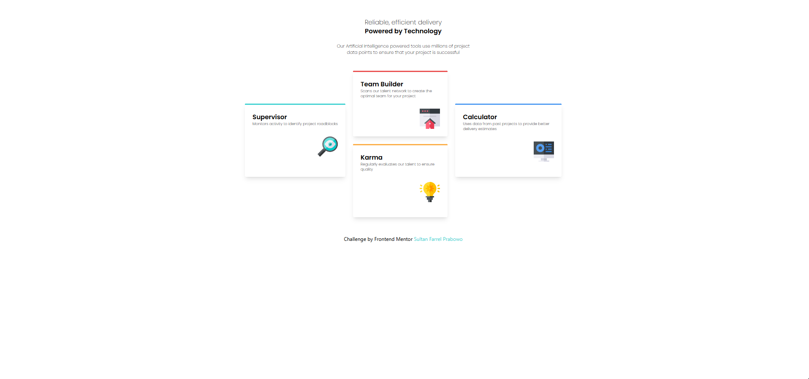
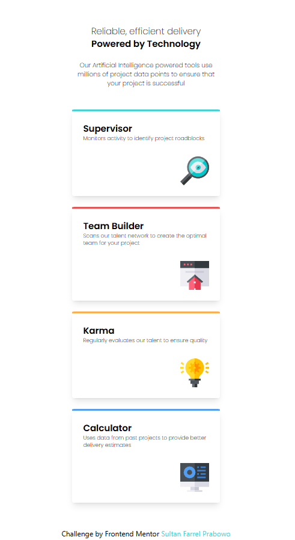

# Frontend Mentor - Four card feature section solution

This is a solution to the [Four card feature section challenge on Frontend Mentor](https://www.frontendmentor.io/challenges/four-card-feature-section-weK1eFYK). Frontend Mentor challenges help you improve your coding skills by building realistic projects.

## Table of contents

- [Overview](#overview)
  - [Screenshot](#screenshot)
  - [Links](#links)
  - [Built with](#built-with)
- [Author](#author)

## Overview

### Four Card Feature Section

This project is a responsive feature section that showcases four distinct cards, each representing a different role or feature with unique descriptions and icons. The design is optimized for both desktop and mobile views, ensuring a seamless experience across devices.

#### Features:

- Responsive Design: The layout is fully responsive, adjusting to various screen sizes, including mobile, tablet, and desktop views.
- Card-based UI: Each feature is represented by a card that includes a title, description, and relevant icon.
- Modern Aesthetics: The project uses a clean and modern design, leveraging custom shadows, colors, and icons for each card.
- Mobile-first Approach: Special attention is given to mobile view, ensuring that the feature section looks great on smaller screens.

Feel free to explore and use this component in your own projects.

### Screenshot

### Links

- Solution URL: [https://www.frontendmentor.io/solutions/four-card-feature-section-with-tailwind-css-7RtMd6hSsu](https://www.frontendmentor.io/solutions/four-card-feature-section-with-tailwind-css-7RtMd6hSsu)
- Live Site URL: [https://sultanfarrel.github.io/four-card-feature-section/](https://sultanfarrel.github.io/four-card-feature-section/)

### Built with

- Semantic HTML5 markup
- Tailwind CSS
- Flexbox
- Mobile-first workflow

## Author

- Website - [Sultan Farrel](https://www.sultanf.my.id)
- Frontend Mentor - [@SultanFarrel](https://www.frontendmentor.io/profile/SultanFarrel)
- Instagram - [@farrelsultan15](https://www.instagram.com/farrelsultan15)
